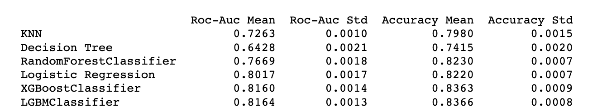

# Churn Prediction Model #

This repository is a template for the **churn prediction** model. **It's objective** is to predict whether a customer is going to return (order again from us) in **the upcoming 6 months** or not.  

## Data dictionary  
  
There are [two data samples](./input/) provided as CSV files.  
  
### Order data  
  
The [order dataset](./input/machine_learning_challenge_order_data.csv) contains the history of orders placed by customers acquired between 2015-03-01 and 2017-02-28. The data points were *synthetically* generated to reflect patterns of real data for the exercise.  

### Labeled data  
  
The [labeled dataset](./input/machine_learning_challenge_labeled_data.csv) flags whether the customers placed at least one order in 6 months after 2017-02-28 or not.  

### Getting Started ###

```
$ git clone https://github.com/hks-task/churn-model.git
$ cd churn-model/src
$ python main.py
```

### Usage ###

The service template can be executed running main.py, with the precondition that requirements are provided.
The general pipeline for this service template is the following:

* Fetch the necessary data from files
* Explanatory data analysis (+notebooks)
* Feature engineering
* Model & parameter selection (+notebooks)
* Performance evaluation and monitoring
* Export the model to an S3 bucket

The template in this repository has functions that successfully execute all of these steps.

### Components ###

The template consists of 7 components:

* data_access.py: read order, label datasets and merge them
* utils.py: reduce memory usage
* pip-requirements.txt: get necessary packages
* Dockerfile: build an image
* functions.py: data transformation & engineering 
* model.py: run the lgb model
* main.py: execute all pipeline

The notebooks consist of 5 components:

(**Note**: Most functions (read_data, transform_data, etc.) in notebooks are similar and we could import them from a helper file rather than creating in every notebook. In this part, we design notebooks for reviewers for not spending their time between different folders. In the .py version, they are executed efficiently.)


#### 1. Explanatory Data Analysis ####

- Import libraries & datasets
- Check datatypes, duplicative and distinct values 
- Check missing values and impute them
- Check anomalies and handle with them
- Visualize orders in a year, month, day, hour breakdowns
- Visualize revenue distribution by client 
- Visualize target variable
- Create order-recency matrix
- Create a correlation matrix

#### 2a. Baseline Model (similar steps in 2b and 2c) ####

- Import libraries & datasets
- Change datatypes and reduce memory usage
- Label encode categorical features
- Fill null values with the forward-filling method
- Add recency, number of days from the first order
- Add year, month, week, day, is weekend features
- Convert raw data to a session format
- Run different models
- Calculate and compare scores



#### 2b.Baseline Model+Rolling Window Features ####

- Add day differences between consecutive orders 
- Add mean of features in 3 days, 1, 2, 4, 12, 24 weeks (std(), sum() may be added.)


#### 2c.Baseline Model+Rolling Window+Categorical Features ####

- Add unique customer count by restaurant, city
- Add churn rate by restaurant, city

#### 3. Final Model+Parameter Selection ####

- Try different parameter combinations for the final lightGBM classfier model

#### 4. Model Results+Interpretation ####

- Create confusion matrix
- Create feature importance chart
- Visualize model predictions in order-recency bins matrix
- Analyze model performance in order-recency bins matrix
- Save client_id, y_pred, y_actual results 


The features below would increase model performance: 

- Rating
- Comment
- Delivery time
- Live chat experience
- Cancel reasons (courier, rest, user, etc.)
- Age, gender, device type, district, OS type
- Geolocation data (whether customers in our service area or not)

There is a trade-off between the time you spent and the improvement in the model scores. We could spend more time on different models (NN, CatBoost, stacked models, etc.) or tuning hyperparameters for further studies.


### Author ###
Hakkı Kaan Şimşek - [github](https://github.com/HakkiKaanSimsek)